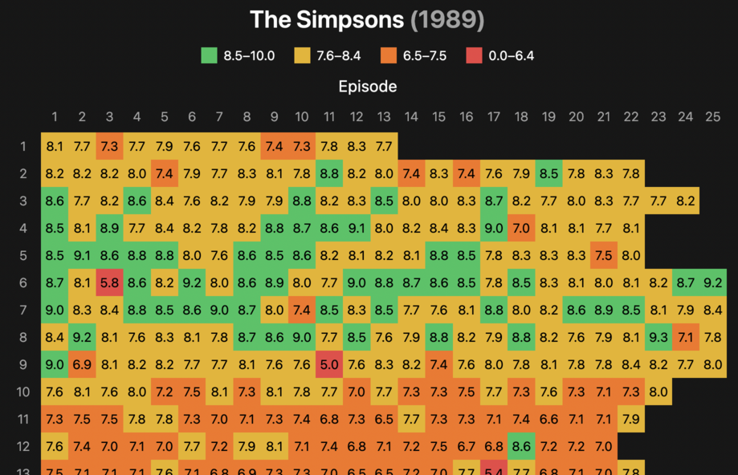

# IMDb Table

IMDb rating tables for TV shows.

[https://docyx.github.io/imdb-table](https://docyx.github.io/imdb-table)

[](https://docyx.github.io/imdb-table/?id=456#/the-simpsons)

## Development Notes

For the development server to function properly, you must make the following change in [./server/vercel.json](./server/vercel.json):

```diff
"key": "Access-Control-Allow-Origin",
- "value": "https://docyx.github.io"
+ "value": "*"
```

Make sure you don't commit this change when submitting a PR. Thanks!

Additionally, you need to install the [Vercel CLI](https://vercel.com/docs/cli) by running:

```
npm i -g vercel
```

To start the development server, run `vercel dev` inside the `./server` directory and you're good to go.

## License

[MIT](./LICENSE)
